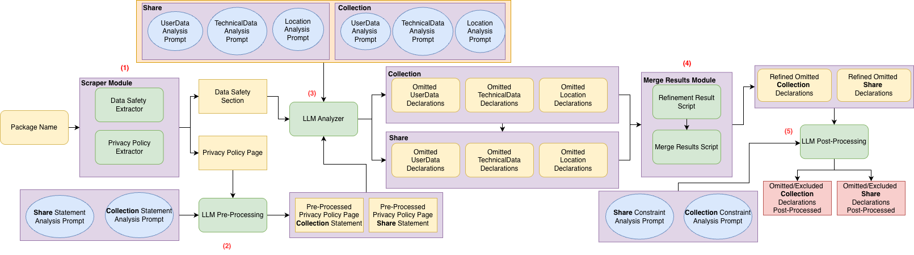

# PolicyGapper: A Multi-Prompt LLM-Based App Privacy Compliance Analysis

<a id="fig-architecture"></a>

<br>
*Figure 1: PolicyGapper Workflow*


This repository proposes a **novel methodology for automated privacy compliance analysis** of mobile applications based on **multi-prompt Large Language Model (LLM) cooperation**.  
The framework applies to  **Android**  application packages and operates **without requiring source code or additional information**.

The system is composed of **five cooperating modules**, orchestrated according to the workflow shown in [Figure 1](#fig-architecture).

---

## 🧩 Overview

The methodology automatically compares the **privacy declarations on public app stores** (e.g., Google Play “Data Safety” section) with the **actual data collection and sharing practices described in the app’s Privacy Policy**.  
By integrating multiple specialized LLM prompts and structured pre/post-processing pipelines, the approach aims to detect **omitted declarations** in the store metadata.

---

## 📋 Requirements

- Docker
---

<div align="center">

## 📦 Package Attributes

<p>
    <a href="https://www.python.org/downloads/"></a>
    
</p>
<p>
    
    
    
</p>

</div>

---


## 👨‍💻 How To Use

### Pre-Build

Insert your API KEY in 'docker-compose.yml'

```yml
services:
  dss-validator:
    build: .
    image: dss-validator:ubuntu25
    environment:
      - GEMINI_API_KEY=INSERT_YOUR_GEMINI_API_KEY_HERE
    volumes:
      - ./PolicyGapper/input:/app/PolicyGapper/input
      - ./AnalysisResults:/app/PolicyGapper/AnalysisResults
      - ./DSS:/app/DSS
      - ./PPP:/app/PPP
```
### Build

```bash
docker compose up --build 
```

## Pre-Run
Insert PACKAGE_NAME you want analyze

```bash
echo "PACKAGE_NAME_APP" > PolicyGapper/input/packages.txt
```


### Run

```bash
docker compose run --rm dss-validator bash -c "bash ./run.sh "

```
The results are in ```./AnalysisResults``` folder.

---

## ⚙️ Architecture

### 1. Scraper Module
Collects all publicly available information required for later analysis.

#### 1.1 Data Safety Extractor
- Extracts metadata from the **Google Play Store page** of an application using its package name.  
- Focuses on parsing the **Data Safety section**.  
- Outputs a structured **JSON** file containing all declared data types.  
- Implementation uses the open-source [`google-play-scraper`](https://github.com/facundoolano/google-play-scraper) library.

#### 1.2 Privacy Policy Extractor
- Uses the privacy policy URL extracted from Google Play.  
- Launches a headless browser with a custom `User-Agent`.  
- Waits 3 seconds for JavaScript content to load, removes cookie banners, and exports the rendered page as a **PDF** file.

---

### 2. LLM Pre-Processing Module
Processes the downloaded privacy policy to extract only relevant statements.

- Separates statements regarding **data collection** and **data sharing**.  
- Uses two dedicated prompts:  
  - `Sharing Statement Analysis Prompt`  
  - `Collection Statement Analysis Prompt`

**Rationale:**
1. Reduces input size and minimizes LLM hallucinations.  
2. Cleans and normalizes the extracted text from PDFs for better downstream analysis.

---

### 3. LLM Analyzer Module
Core analytical module that compares:
- The relevant privacy policy statements, and  
- The parsed Google Play Data Safety declarations.

**Goal:** Identify *omitted* or *inconsistent* disclosures regarding data collection and sharing.

#### Analysis structure
- Considers all **39 data types** and **14 categories** defined in the official Google Play documentation.  
- Uses **six specialized prompts** (three for collection, three for sharing):
  1. *User Data* (e.g., Personal Info, Contacts, Files)
  2. *Technical Data* (e.g., Device IDs, Performance Metrics)
  3. *Location Data*

**Output:**  
Six JSON files representing potential omissions — three for collection and three for sharing.

---

### 4. Merge Results Module
Aggregates the raw results from the analyzer into unified outputs.

- Produces a single JSON file for **collection** omissions.  
- Produces a single JSON file for **sharing** omissions.  
- Ensures that all candidate omissions are validated under consistent documentation constraints.

---

### 5. LLM Post-Processing Module
Performs final validation of the candidate omissions.

**Output format:**
```
{
    "omitted_declarations": [
        {
            "data_type": "Name",
            "policy_reference": "Exact excerpt from the privacy policy",
            "lang": "en"
        }
    ],
    "exclude_declaration": [
        {
            "data_type": "email",
            "policy_reference": "Exact excerpt from the privacy policy",
            "reason_of_removal": "Data collected outside the app",
            "justification": "The policy states this data is collected at ..... This does not need to be declared in the app's Data Safety section.",
            "lang": "en"
        }
    ],
}
```

#### Processing stages
1. **Semantic Coherence Check:**  
   Ensures that each `data_type` is logically supported by the quoted privacy policy excerpt.  
   Incoherent pairs are labeled as *false positives* (FPs) and removed.

2. **Documentation Constraint Check:**  
   Verifies compliance with official Google Play disclosure rules.  
   Excludes legitimate non-disclosure cases such as:
   - On-device processing or anonymized data.  
   - End-to-end encrypted data.  
   - WebView-specific collection.  
   - Transfers not considered “sharing” (e.g., service providers, legal obligations, user consent).

---

## 📦 Output Summary

| Stage | Output File | Description |
|--------|--------------|-------------|
| Scraper | `DSS/{pkgName}.json` | Google Play extracted info |
| Scraper | `PPP/{pkgName}.pdf` | Rendered Privacy Policy page |
| Pre-Processing | `AnalysisResults/PreAnalysisResultsCollection/{pkgName}.json` | Extracted collection statements |
| Pre-Processing | `AnalysisResults/PreAnalysisResultsShare/{pkgName}.json` | Extracted sharing statements |
| Analyzer | `AnalysisResults/AnalysisResultsCollection/{pkgName}_{CollectionDeviceData/CollectionPersonalInfo/CollectionUserGeneratedData}.json` | Category-based potential omissions |
| Analyzer | `AnalysisResults/AnalysisResultsShare/{pkgName}_{ShareDeviceData/SharePersonalInfo/ShareUserGeneratedData}.json` | Category-based potential omissions |
| Merge | `AnalysisResults/AnalysisResultsCollection/{pkgName}.json` | Merged candidate omissions (collection) |
| Merge | `AnalysisResults/AnalysisResultsShare/{pkgName}.json` | Merged candidate omissions (sharing) |
| Post-Processing | `AnalysisResults/AnalysisResultsShare/{pkgName}_COLLECTION_VALIDATED.json` | Confirmed omissions after validation |
| Post-Processing | `AnalysisResults/AnalysisResultsShare/{pkgName}_SHARE_VALIDATED.json` | Confirmed omissions after validation |

---

## 🧠 Key Advantages

- **No source code required:** works purely from public information.  
- **Language-agnostic:** supports multilingual privacy policies.  
- **Modular:** each module can operate independently or in orchestration.  
- **LLM-guided reasoning:** multiple prompts improve precision and reduce hallucination risk.  
- **Compliance-driven filtering:** adheres to Google Play’s official requirements.

---
